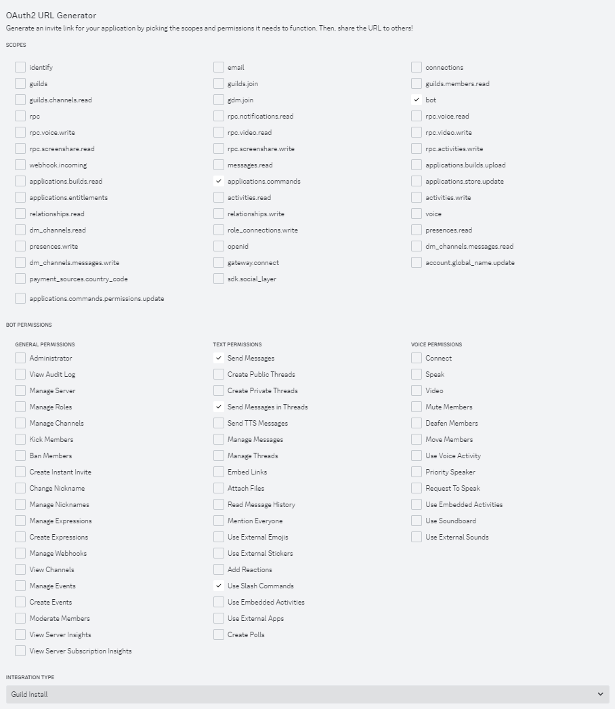
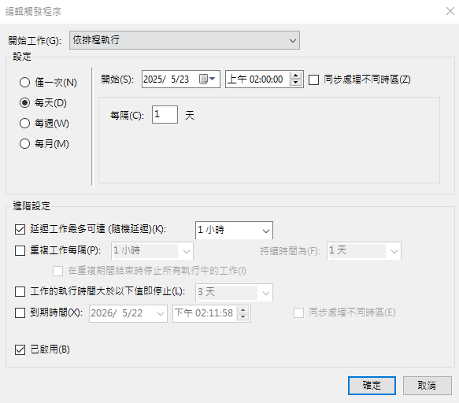
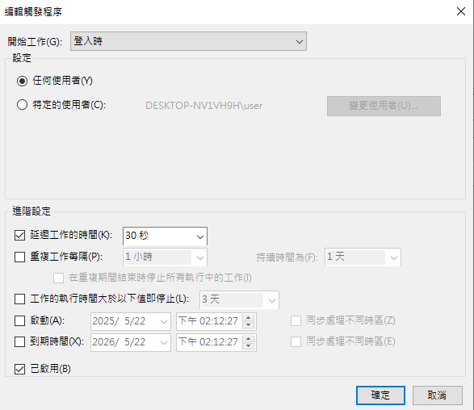

# discord_ticket_bot

<!-- GETTING STARTED -->
## Getting Started

This repository is for NTU Lifeguard. The repo creates a chatbot, which is powered by Selenium and Discord API. By sending messages in specific Discord channel, the chatbot will generate QRCode for NTU swimming pool and NTU fitness center.

### Usage Example


### Requirements
* Python 3.10.4
* pip 22.0.4

### Installation

1. Clone the repo
   ```sh
   git clone https://github.com/ycchang0324/discord_ticket_bot
   ```

1. change directory to the folder
   ```sh
   cd discord_ticket_bot
   ```

3. install packages
   ```sh
   pip install -r requirements.txt
   ```

4. Download webdriver with appropriate version, for more details please check [here](https://developer.chrome.com/docs/chromedriver?hl=zh-tw).

5. Create a Discord chatbot, for more details please check [here](https://discord.com/developers/docs/intro).

The setting for discord bot is shown in the following picture.


6. Add the payment QRCode as payment_qrcode.png in img folder.

7. Create .env file, copy the text in .env.example and fill in  
(1) Discord channel IDs(can be multiple, separated by colons)
(2) Discord channel name(only for main channel's name)    
(3) NTU account  
(4) NTU password  
(5) NTU rental system url: https://rent.pe.ntu.edu.tw/member/  
(6) Discord bot token.  
(7) Maintainer's Name  
(8) Maintainer's ID  
(9) Bot Name

8. Edit the payment message
```python
await ctx.followup.send("...", file=qrcode, ephemeral=True)
```
, which is in the function
```python
@bot.slash_command(name="help", description="呆呆獸怎麼用")
```
in main.py. Please notice that if the payment QR code is not needed,  please replace the QR code picture by empty picture by uncomment the code
```python
qrcode = discord.File(qrcode_path, filename="empty.png")
```


<!-- USAGE EXAMPLES -->
## Usage

1. execute main.py
   ```sh
   python main.py
   ```

2. To prevent sudden occurence such as power failure or network disconnection, you can create .bat file and uses Task Scheduler, which is a Windows build-in tools to wake up the chatbot. The Task Scheduler can execute the code after starting up or once in a while.
   ```sh
   cd /d "the absolute directory of the repository in your computer"
   call python main.py
   REM pause
   ```
The example setting for task scheduler is shown in the following picture.



You can use remote desktop connection sofeware(eg. TeamViewer, Anyviewer) to fix the failure condition manually.

## Maintainer's prompts

The mainainer can send specific messages to the bot either privately or publicly.

1.    
```sh
   welcome
```

The bot will send the welcome message to the channel.

2.    
```sh
   swimming
```

The bot will send the message that the swimming tickets is full.

3.    
```sh
   gym
```

The bot will send the message that the gym tickets is full.

4.    
```sh
   fixed
```

The bot will send the message that the bot has been fixed.

<!-- CONTACT -->
## Contact

Yuan-Chia, Chang - ycchang0324@gmail.com

Project Link: [https://github.com/ycchang0324/discord_ticket_bot](https://github.com/ycchang0324/discord_ticket_bot)

